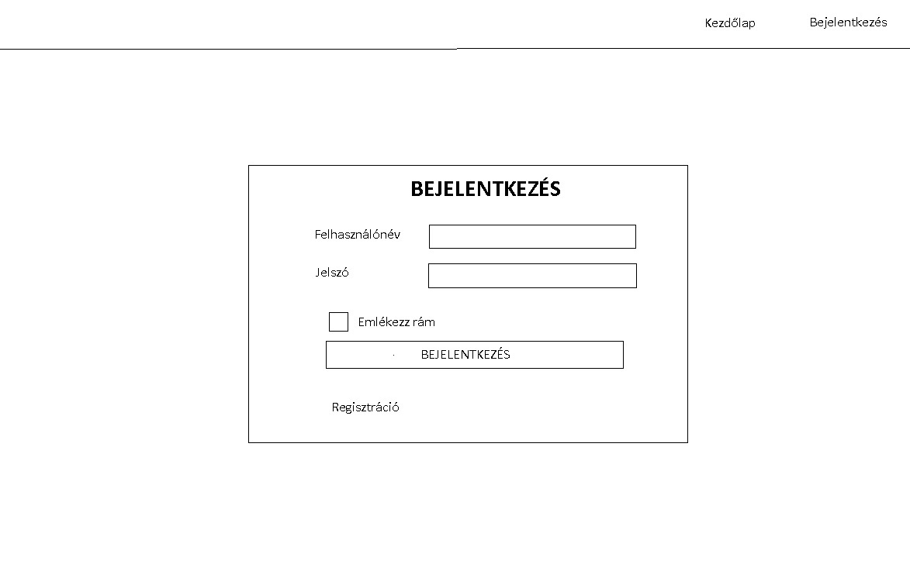
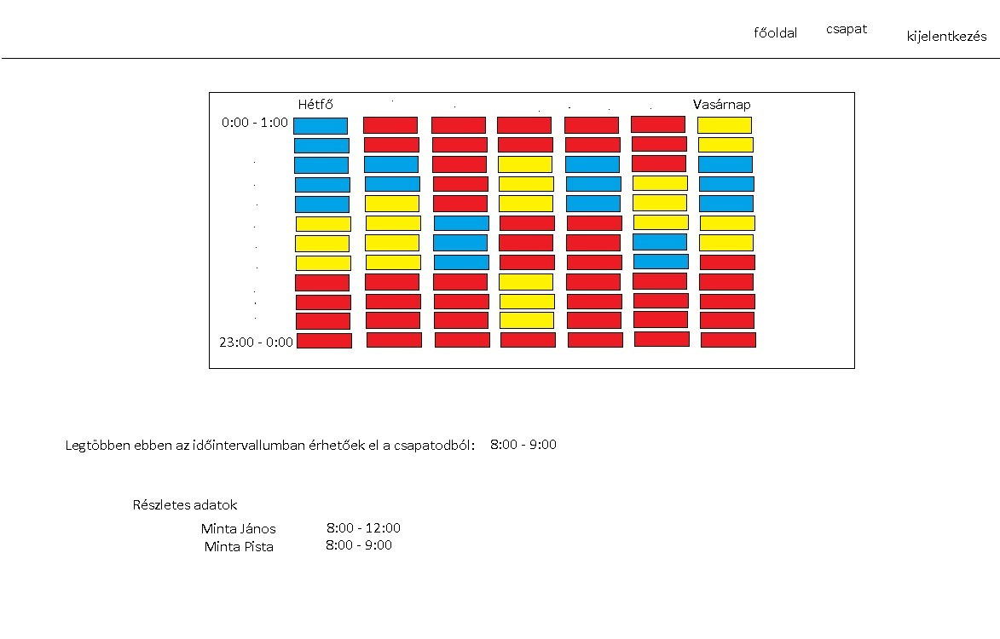
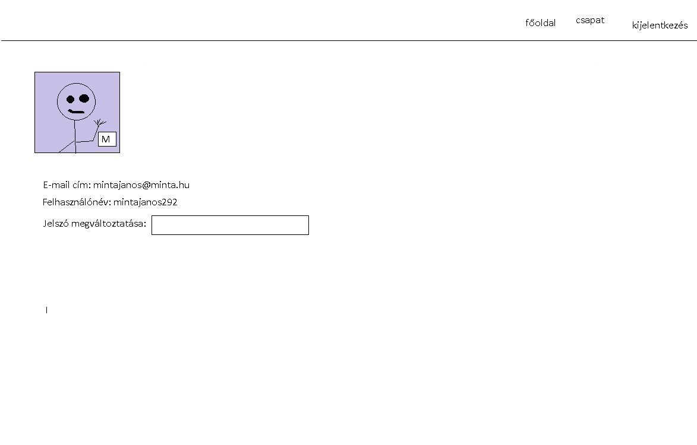
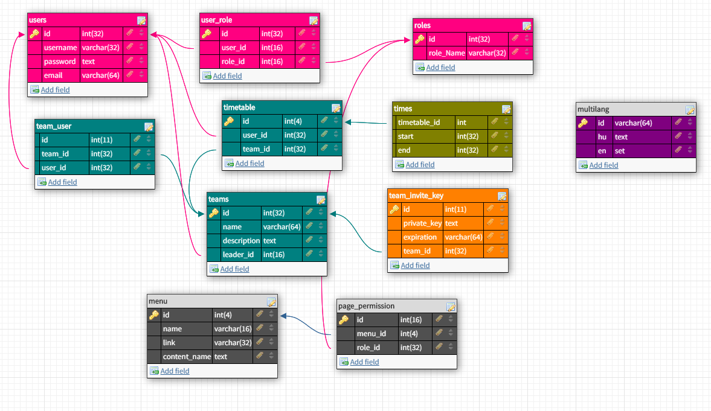

# Rendszerterv
* * *
### Tartalomjegyzék
- [1. Bevezető](#Bevezető)
- [2. Projektterv](#projektterv)
- [3. Projekt fizikai környezete](#projekt-fizikai-környezete)
- [4. Karbantartási tervezet](#karbantartási-tervezet)
- [5. Felhasználói felület](#felhasználói-felület)
- [6. Adatbázis terv](#adatbázis-terv)
- [7. Üzleti folyamatok](#üzleti-folyamatok)
- [8. Tesztterv](#tesztterv)

 [1.]
### Bevezető
[1.1] 
Az EasyPlanner célja, hogy megkönnyítse a rendszeresen összejáró csoportok számára a találkozók idejének a meghatározását és jól látható egyértelmű módon vizualizált formában is tudassa azt a felhasználóval. Ezt oly módon teszi, hogy a tagok mindegyike kiválasztja az egyes napokra a számáre legmegfelelőbb időpontokat, időintervallumot és ezek összegzése utána a rendszer minden egyes napra meghatároz idősávot/idősávokat, amelyben a lehető legtöbb tag elérhető. Továbbá ezt egy táblázatban ábrázolja is. A táblázatban látható legyen, hogy az adott napon kik és mikor érnek rá az adott tevékenységre, információt tudjon szolgáltatni arról, ha valaki egyáltalán nem ér ra aznap vagy épp nem biztos a megadott időpontban (talán elérhető a felhasználó).

 [2.]
### Projektterv

[2.1] 
###### Emberi erőforrások
Az EasyPlanner weboldalon a Tacos kft. tagjai név szerint:
- Lácza Roland
- Varga Attila
- Guzsik Dániel
- Erdős Péter

###### Projekt időtartama
[2.2] 
Az EasyPlanner weblap projektjének elkészülési határideje 2019. szeptember 30. (Amennyiben ez nem teljesül az elég nagy probléma lehet a Taco kft. számára)

###### [2.3] Mérföldkövek meghatározása:
 [2.3.1] 
 Domain meghatározása: Megfelelő domain név meghatározása. Elérhető szolgáltató felkutatása és a domain lefoglalása, üzembe helyezése.
 [2.3.2] 
 Regisztárlciós űrlap elkészítése: A regisztrálciós űrlap működőképes a jelszó tárolása biztonságos, a felhasználónév ütközések vizsgálata és azok tiltása
 [2.3.3] 
 Bejelentkezés/Kijelentkezés: A már regisztrált felhasználók mindegyike képes az oldalra bejelentkezni és kijelentkezni.
 [2.3.4] 
 Az alkalmas időpontok kezelése: A felhasználó meg tudja adni a számára elérhető időpontokat a renszer ezt képes kiértékelni a többi felhasználótól származó időpontokkal.
 [2.3.5] 
 Táblázatok készítése a befolyt adatokból: A rendszer a heti táblázatokat képes megalkotni, vizuális információt szolgáltat a táblázaton keresztül a megfelelő időpontokról
 [2.3.6] 
 Táblázat adatainak kiértékelése egy külön lapon
 [2.3.7] 
 Csapat léterhozásának lehetősége felhasználók számára
 [2.3.8] 
 Admin felület elkészítése, admin folyamatok implementálása(pl.:jogkör adás/elvétel)
 [2.3.9] 
 My account felület elkészítése, felhasználói fiók kezelésének lehetsőge

 [3.]
### Projekt fizikai környezete
Az EasyPlanner egy böngészőben futó webalkalmazés, ennek következtében a használatához valamilyen böngésző (Google chrome, Firefox, Opera, Internet Explorer) használata szükséges.

A projekt által támogatott eszközök:
- asztali számítógép/laptop
- mobil készülékek (modern maroktelefon, tablet)

A webalkalmazás bármely fentebb említett böngészőket futtatni képes operációsrendszeren elérhető.

 [4.]
### Karbantartási tervezet

A projekt átadása után a megrendelővel együttesen meghatározott megállapodás alapján.

 [5.]
### Felhasználói felület

[5.1] 
**Belépés a rendszerbe**
A felhasználó a főoldalt, azon is csak bizonyos szövegeket fog látni, ezen kívül pedig csak bejelentkezni, és regisztrálni tud majd. Felhasználónév, jelszó megadásával belépteti a rendszer, és átdobja a főoldalra. Ezt regisztrációnál email cím, felhasználónév, jelszó megadásával  szintén bejelentkezteti a főoldalra.

Elképzelés:

 [5.2] 
**Csapathoz csatlakozás**
Minden felhasználónak első körben csatlakoznia kell, vagy létre kell hoznia egy csapatot, ezután átirányítja egy oldalra, ahol megadhatja a heti beosztását egy táblázat segítségével.

Elképzelés:

 [5.3] 
**Profil szerkesztése** 
MInden felhasználónak lehetősége nyílik arra, hogy megváltoztassa a jelszavát és az avatarját egy előre definiált listából. Továbbá a felhasználó alap adatai is megjelennek az oldalon

Elképzelés:

###### Implementációs terv

Az alkalmazást PHP nyelven írjuk, keretrendszerek használata nélkül, csupán a Bootstrap, jQuery, popper.js könyvtárakat vesszük igénybe. A Model View Controller szerkezeti mintát követjük, és ez alapján építjük fel a mappaszerkezetet is. Modulokban gondolkodunk, külön modul lesz egyes rendszerek implementálására, ilyen például a beléptető rendszer (login system), ezáltal könnyebb lesz bővíteni később a rendszert. Minden modulon belül lesz külön az üzleti logikára koncentráló (model) rétegünk, ami nagyban elváll a megjelenéstől (view) és a vezérléstől (controller). Egy-egy landing pagenek lesz külön absztrakciós osztálya, ami lebonyolítja a futási sorrend problémát, hogy mindenképpen először a felhasználó bemenő adatait kezeljük, és csak utána jelenítsük meg a végeredményt. További tervezési mintákat is alkalmazunk a projekt során: factory method, singleton Egyetlen belépési pont az index.php lesz, így könnyebb lesz levédeni esetleges támadások ellen. A webalkalmazást egy külső webtárhelyen tároljuk amelyet egy szolgáltatótól bérlünk (RackHost). 
**Üzleti logikát implementáló osztályok** 
*User* Magát a felhasználót reprezentálja, ennek az osztálynak a segítségével lehet beazonosítani egy embert. 
*UserManager* 
A felhasználón végzett műveleteket végezzük ebben az osztályban, mint például a csapatválasztást egy játékosnak. Singleton osztály.
*Team* Egy adott csapatot reprezentál, paraméterként kap egy azonosítót, amely alapján egy csapatot tud kezelni az interfészén keresztül. 
*TableManager* A táblákat, csapatokat, felhasználókat összekötő manager osztály, ebben lehet lekérdezni az összes felhasználóhoz tartozó táblát, vagy akár csapat tagjaihoz tartozó táblákat, ez foglalkozik többek között az időpont-ütközésekkel is.
Singleton osztály
*TimeTableManager* 
Az időpont táblázaton végzett műveleteket implementáljuk, például itt szeletelünk fel időintervallumokat időpontokká, és fordítva. Singleton osztály.

 [6.]
### Üzleti folyamatok
- **Felhasználó felvétele**: Mivel az eddigi rendszerben  nem lehettünk biztosak abban, hogy a mezőket a megfelelő felhasználó töltötte-e ki, a jövőbeli rendszerben muszáj lesz előzetesen regisztrálni ahhoz, hogy valamilyen módosítást végezzünk.
- **Csapatok kezelése**: Az eddigi rendszerben a csapatok kezelése manuálisan kézileg és biztonsági szempontból is megkérdőjelezhetően működött. A weboldalon lehetőség lesz  csapatokat létrehozni. amibe csatlakozni felhasználó alapján felvétellel, csapatokhoz való jelentkezéssel vagy a csapatkapitány által generáltatható meghívó hivatkozás birtokába lehet.
- **Csapattagok kezelése**: A csoport vezetőjének lehetősége lesz felhasználókat felvenni felhasználónév, és meghívó link által is. Továbbá, tagok kirúgására is van lehetőség.
- **Táblázat kezelése**: A bejelentkezett felhasználó a táblázat üres mezőjére kattint, ezzel jelzi, hogy az adott időpont neki megfelelő, ekkor a mező zöldre vált. Amennyiben egy zöld mezőre kattint úgy, az a mező fehérre vált. Ezzel jelzi, hogy az időpont nem megfelelő számára.
- **Táblázat mentése**: A felhasználó mikor elkészült a táblázat változtatásával a Tábla mentése gombra kattintva tárolja el a változtatásait. Csak ezek után képes az alkalmazás a bejelölt időpontokat összevetni a többiekével.
- **Csapat létrehozása**: A felhasználó a Csapat létrehozása gombra kattintva elérheti azt a felületet amivel új csapatot hozhat létre. Itt meg kell adja a csapat nevét, és a csapat rövid leírását.
- **Létrehozás megerősítése**: Amennyiben a kitöltött adatokkal a csapat létrehozásánál a felhasználó elégedett. A kék csapat létrehozása gombra kattintva menti azokat, létrehozza a csapat tábláját és be is lép a csapatba automatikusan.
- **Csapat létrehozásának visszavonása**: Amennyiben a csapat létrehozása felületen vagyunk és kitöltöttük a csapat adatait, de mégsem kívánjuk létrehozni azt. A Vissza a főoldalra gombra kattintva, a főoldal jelenik meg és a csapat nem kerül létrehozásra.
- **Intervallum kiszámítása**: A rendszer képes arra, hogy az időintervallumokból, amiket lementünk táblánként kiszámolja a legmegfelelőbb intervallumot, és kilistázza az(okat ha esetleg több lenne belőlük). Lehetséges napra bontani az optimális időket, vagy kilistázni az összes csapattag idejét.

 [7.]
### Adatbázis terv

 [8.]
### Tesztterv
[9.1]  A webalkalmazás tesztelését a fejlesztés során folyamatosan hajtjuk végre. Minden egyegy mérföldkő elkészülésévek a csapat teszteli annak funkcionális működését és ha az javítást igeényel azt megteszi. Az előzőlge elkészült funkciókat pedig minden új mérföldkő tesztelése mellett szúrópróba szerűen teszteljük. A fejlesztés befejezésével a csapat a következő pontben megadott tesztelési tervet lépésről lépésre végrehajtja.
 [9.2]
 <table  style="width:100%" border="1px thin black" >

 <tr>
 <th> Tesztjegy
 <th> Modul
 <th> Művelet
 <th> Hatás
 </tr>

 <tr>
 <td>H0001
 <td>Bejelentkezés
 <td>A bejelentkező űrlapot olyan felhasználó és jelszó párral töltik ki ami előzetesen nem regisztrált a rendszerben.
 <td> Hiba, a felület kijelzi, hogy a felhasználó és jelszó páros nem helyes.
 </tr>

 <tr>
  <td>H0002
  <td>Bejelentkezés
  <td>A bejelentkező űrlapot olyan felhasználóval töltik ki ami nem szerepel az adatbázisan.
  <td> Hiba, a felület kijelzi, hogy a felhasználó nem szerepel a rendszerben.
  </tr>

  <tr>
   <td>H0003
   <td>Bejelentkezés
   <td>A bejelentkező űrlapot olyan  jelszóval párral töltik ki ami nem szerepel az adatbázisban.
   <td> Hiba, a felület kijelzi, hogy a jelszó nem szerepel az adatbázisban.
   </tr>

   <tr>
    <td>H0004
    <td>Bejelentkezés
    <td>A bejelentkező űrlapot olyan felhasználó és jelszó párral töltik ki ami szerepel az adatbázisan.
    <td> Siker, a felület a "Home" oldalra irányít át.
    </tr>

   <tr>
      <td>H0005
      <td>Regisztráció
      <td> A regisztrációs űrlap email mezőjében a beírt szöveg megfelel az email cím szabványnak és a többi mező nem üres és megfelelnek a követelményeknek.
      <td> Siker, a felület a "Home" oldalra irányít át, bejelentkezve.
   </tr>

   <tr>
         <td>H0006
         <td>Regisztráció
         <td> A regisztrációs űrlap email mezőjében a beírt szöveg nem megfelel az email cím szabványnak és a többi mező nem üres.
         <td> Hiba, a felület kijelzi, hogy az email mezőbe írt szöveg nem megfelelő emailcím.
   </tr>
   <tr>
         <td>H0007
         <td>Regisztráció
         <td> A regisztrációs űrlap email mezőjében a beírt szöveg megfelel az email cím szabványnak és a többi mező üres.
         <td> Hiba, a felület kijelzi, hogy a felhasználó, jelszó és a jelszó megerősítő túl rövid vagy nincs kitöltve.      
   </tr>

  <tr>
        <td>H0008
        <td>Regisztráció
        <td> A regisztrációs űrlap email mezőjében a beírt szöveg megfelel az email cím szabványnak és a jelszó mezőbe beírt karaktersorozat hossza kisebb mint 6
        <td> Hiba, a felület kijelzi, hogy a jelszó mezőbe írt karaktersorozat túl rövid.
  </tr>
    <tr>
          <td>H0009
          <td>Regisztráció
          <td> A regisztrációs űrlap email mezőjében a beírt szöveg megfelel az email cím szabványnak és a jelszó mezőbe beírt karaktersorozat hossza nagyobb vagy egyenlő mint 6, viszont a felhasználónév már megtalálható az adatbázisban.
          <td> Hiba, a felület kijelzi, hogy a felhaználónév már szerepel az adatbázisban, válasszon ettől különbözőt.
    </tr>
     <tr>
           <td>H0010
           <td>Regisztráció
           <td> A regisztrációs oldalon a "Regisztrálok" szövegre kattintás.
           <td> Siker, az webalkamazás átirányít a bejelentkező oldalra,
     </tr>
      <tr>
            <td>H0011
            <td>Home
            <td> A kijelentkezés gombra kattintás.
            <td> Siker, felugró ablakban jelezve, a felhasználó kiléptetését.
      </tr>
       <tr>
             <td>H0012
             <td>Home
             <td> Csapat létrehozása gombra kattintás.
             <td> Siker, az alkalmazás a csapat létrehozá oldalra navigál.
       </tr>
      <tr>
            <td>H0013
            <td>Home
            <td> Időpont megadása mezőre kattintva
            <td> Siker, a táblázat kattintott mezője szít vált (fehérről zöldre vagy fordítva).
      </tr>       
      <tr>
            <td>H0014
            <td>Home
            <td> Változtatások mentése gombra kattintva
            <td> Siker, felugró ablakban jelezve, a változtatások mentését.
      </tr>
      <tr>
            <td>H0015
            <td>Home
            <td> Legördülő menüre kattintás (aktuális csapatnév)
            <td> Siker, kiválaszthatjuk kattintással a felhasználó csapatait, annak táblázata jelenik meg.
      </tr>
      <tr>
            <td>H0016
            <td>Home
            <td> Legördülő menüben csapatnévre kattintás
            <td> Siker, kiválasztjuk a csapatot
      </tr>
      <tr>
            <td>H0017
            <td>Home
            <td> 'Csapat létrehozása gombra' kattintás
            <td> Siker, csapat létrehozó űrlapra dobja a felhasználót
      </tr>
      <tr>
            <td>H0018
            <td>Új csapat létrehozása
            <td> Csapat név kitöltése 3 karakternél hosszabb, de 32 karakternél rövidebb névvel, és a csapat leírás kitöltése 15-nél hosszabb, de 128 karakternél rövidebb leírással.
            <td> Siker, csapat létrehozva megadott névvel és leírással
      </tr>
      <tr>
            <td>H0019
            <td>Új csapat létrehozása
            <td> Csapat név és leírás kitöltése a kritériumoknak nem megfelelően.
            <td> Hiba, megfelelő hibaüzenet megjelenítése.
      </tr>
      <tr>
            <td>H0020
            <td>Home
            <td> Csapatra kattintás
            <td> Siker, átvisz a csapat menüpontba
      </tr>
      <tr>
            <td>H0021
            <td>Csapat
            <td> Ha csapatvezető vagy, akkor meghívó link gomb megjelenítése
            <td> Siker, a gomb megjelent
      </tr>
      <tr>
            <td>H0022
            <td>Csapat
            <td> Meghívó link gombra kattintás
            <td> Siker, az eddig üres mezőbe egy link generálódott, amit a mellette lévő ollóval ki lehet másolni
      </tr>
      <tr>
            <td>H0023
            <td>Csapat
            <td> Az ollóra kattintással vágólapra tenni az inputban lévő linket
            <td> Siker, az inputban lévő link a vágólapon
      </tr>
      <tr>
            <td>H0024
            <td>Bejelentkezés
            <td> A kimásolt linkkel látogatva az oldalt ha az illető nincs bejelentkezve, akkor a bejelentkezés pontra dobja
            <td> Siker, az illetőt a bejelentkezés menüpontra dobja.
      </tr>
      <tr>
            <td>H0025
            <td>Home
            <td> Bejelentkezés után bedobja a meghívott csapatba. innentől az is kiválasztható.
            <td> Siker, bejelentkezés után a csapat megjelenik és kiválasztható
      </tr>
      <tr>
            <td>H0026
            <td>Team
            <td> Az időpontok kiválasztása és mentése után a csapat menüpont szabadidők tábla változása.
            <td> A mentett időpontok megjelennek intervallumként a táblán.
      </tr>
      <tr>
            <td>H0027
            <td>Team
            <td> Az időpontok törlése és mentése után a csapat menüpont szabadidők tábla változása.
            <td> A törölt időpontok eltűnnek a Szabadidő oszlopából. 
      </tr>
      <tr>
            <td>H0028
            <td>Team
            <td> Időpontok megadása után a közös időpontok változása.
            <td> Siker, ha nincs más embernek megjelölt időpontja a lista üres.
      </tr>
      <tr>
            <td>H0029
            <td>Team
            <td> Időpontok megadása után a közös időpontok változása.
            <td>Amennyiben van közös időpont az időpont kezdete és vége megjelenik a táblán.
      </tr>
      <tr>
            <td>H0030
            <td>Team
            <td>Időpontok törlése után a közös időpontok változása.
            <td>A törölt időpontok kikerülnek a közös időpontokból, amennyiben már csak egy embernek megfelelő az időpont.
      </tr>

 </table>
 
 [9.3] 
##### A tesztelés sémájának megadása: 

Az alábbi táblázat kitöltése, melyben a név: a tesztelő neve. A Tesztjegy a 9.2 ben megadott Tesztjeggyel megegyező tesztjegy. A Művelet 9.2 ben az adott tesztjegyhez megadott művelet. A Várt hatás a 9.2 ben megadott Hatás az adott tesztjegyhez. Eredmény a tényleges hatásnak a leírása.

 
<table  style="width:100%" border="1px thin black" >
    <tr>
        <th>Név
        <th>Tesztjegy
        <th>Művelet
        <th>Várt hatás
        <th>Eredmény
    </tr>
    <tr>
        <td>Tesztelő neve
        <td>Hpélda
        <td>A tesztjegyhez tartozó művelet
        <td>Tesztjegyhez tartozó várható hatás
        <td>Eredménye a tesztelésnek
    </tr>    
</table>